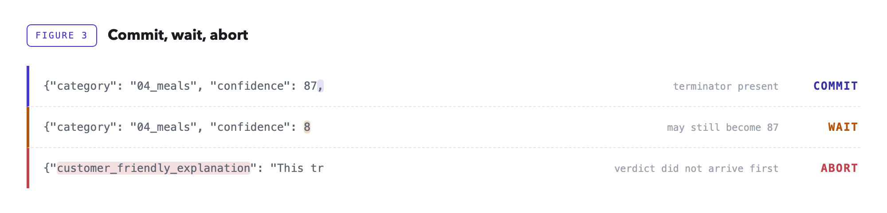
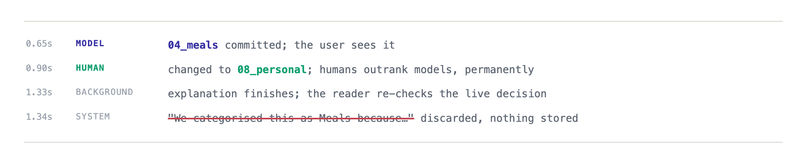

A structured LLM response can become useful before it becomes complete.

In our transaction classifier, the category and confidence score arrived in roughly the first thirty output tokens. That was enough for the application to act. The next two hundred or so tokens were explanations, citations, and internal notes intended for humans.

Yet we had been treating the entire JSON object as one atomic result.

Once we put the decision fields first and acted as soon as they became structurally final, median time-to-act fell from 1.33 seconds to 0.65. The explanation continued in the background.

That response shape had not been designed in one sitting. It had accumulated one reasonable product request at a time.

At first, the classifier had one job: look at a bank transaction and return a category. Coffee in, `04_meals` out. The response was tiny and the interface felt immediate.

Then product did what product does. The app needed to explain each category, because a label that appears from nowhere does not inspire confidence, so we added a customer-friendly explanation. Our internal accountants wanted a more technical explanation and a citation to the relevant guidance, so they could review a classification when something looked wrong. Finally we added a confidence score, to route uncertain transactions into a review queue.

Every field had a legitimate audience. They simply did not have the same deadline. Category determined what the application did immediately, and confidence decided routing. The explanations and the citation belonged to screens and investigations that happened later, if at all.

None of those additions seemed large enough to justify redesigning the request path. Together, however, they made the application wait for every audience at once, and pushed the moment of action all the way to the closing brace.

The obvious remedies all looked expensive. We could split the work into two model calls, but then the second call might explain a different verdict from the one we had already committed. It would also repay per-call overhead, consume more rate-limit capacity, and complicate failure handling.

The eventual fix did not require a second model call or a shorter response. It required a different way of reading the response we already had.

## Part I · Diagnose — Why are we waiting?

### A response has two audiences

Most structured LLM responses serve two audiences. The application needs a short decision now. A human may need supporting prose later — an explanation, a citation, an audit note. Call them the **verdict** and the **essay**.

A response from our classifier, lightly redacted, makes the split concrete:

```json
{
  "category": "09_general_purchase",
  "confidence": 75,
  "customer_friendly_explanation": "This purchase has been categorised as a general business purchase. If it was for stock, office equipment, or personal use, you can update the category.",
  "internal_explanation": "The description denotes a payment to a general online marketplace. No invoice or line-item detail is attached and the amount is small, so the safest default for an ambiguous generic merchant is a general business purchase.",
  "citation": "Internal bookkeeping guidance, general business purchase."
}
```

The first two fields are the verdict: `category` is written to the transaction, `confidence` decides whether it enters a review queue. Everything after them is the essay. It is not filler — an accountant reviewing a questionable classification needs it — but nothing in the request path is waiting on it.

Requirements expand the essay far faster than the verdict. A classifier starts with a single decision field and accumulates prose around it, while the decision itself barely changes.


*Figure 1 — How product requests moved the commit point. **The schema reflected the order of requests, not the order of urgency.** The essay grew gradually; the commit point moved only when `confidence`, the second field needed immediately, was appended after it.*

The response was already arriving one token at a time. We had simply decided that none of those tokens counted until the last one appeared.

We had been treating the closing brace as if it marked the moment the model had finished *deciding*. It did not. It marked the moment the model had finished *explaining itself*.

That distinction is the entire technique.

> **Scope note.** Reordering an autoregressive output may affect the model's final choice, so accuracy must be benchmarked separately. Early reading cannot alter tokens already emitted; in our schema, the later prose explained the verdict rather than deriving it.

## Part II · Prove — When is the verdict final?

### A stream is not a sequence of values

Streaming is usually treated as a UI feature: humans are comfortable reading half a sentence, so tokens appear as they are generated and perceived latency improves. Machines are less accommodating. Half a JSON document is not JSON: there is no closing brace, strings may be unfinished, and a conventional parser is correct to reject every incomplete prefix.

A streamed response arrives as a sequence of frames, each carrying a delta: the next fragment of generated text. The boundaries are arbitrary. A frame may end inside a quoted string, after the first digit of a number, or immediately before the comma that proves a value is complete. No business logic should assign meaning to an individual frame; the only meaningful object is the accumulated buffer.

Structured output changes what can be inferred from that buffer. When a provider enforces the schema during decoding, the model is no longer free to produce arbitrary text. That is a useful foundation, but it does not, by itself, make an early commit safe. The difficult part is knowing when a field is *finished*.

### Presence is not finality

A partial-JSON parser may tell you that a field has appeared in the buffer. That does not mean its value is complete.

*Consider:*

```json
{
  "category": "04_meals",
  "confidence": 8
```

*The parser can already see confidence, but the next chunk may contain:*

```
7,
```

The final value is 87, not 8.

A string is complete only after its closing quote. A number is complete only after a valid terminator, such as a comma, closing brace, or whitespace.

A partial parse that may disagree with the final JSON is not safe to use. Early commit therefore means finding a prefix whose meaning can no longer change, even though the full response is still arriving.

### The schema is also a schedule

The first implementation step was almost disappointingly simple: we placed the verdict fields first.

Until then, the fields had sat in the order they were added, which put confidence, the newest arrival, at the very end. Nobody had chosen that order. It was the order the requirements arrived in.

*A simplified version of the schema looked like this:*

```json
{
  "type": "object",
  "additionalProperties": false,
  "properties": {
    "category":   { "type": "string", "enum": ["01_income_employment", "...", "08_personal"] },
    "confidence": { "type": "number", "minimum": 0, "maximum": 100 },
    "customer_friendly_explanation": { "type": "string" },
    "internal_explanation": { "type": "string" },
    "citation": { "type": "string" }
  }
}
```

> The exact way field order is expressed varies by provider: some expose an explicit ordering property, others follow the order of properties in the schema. Strict modes typically also require every property to appear in `required`, and commonly reject schemas that allow additional properties. Either way, test it against the specific model and API path you use in production.

Most engineers first encounter a schema as a validation contract: the completed response must have this shape.

During constrained generation, it serves another purpose. It influences what the decoder is allowed to produce next.

> **The schema is not only a contract. It is a schedule.**

The last verdict field defines the earliest possible commit point.


*Figure 2 — Same response, earlier action. **Same fields, same tokens; only the commit point moved.***

Nothing generates faster; the useful tokens simply arrive earlier.

> **Provider requirement.** The API must enforce the schema during generation and preserve field order while streaming. Verify both on the exact model and API path you use. And note: streamed tool-call arguments often expose the same partial-JSON shape.

### Three proofs before commit

We wanted the early path to be conservative.

A missing early verdict was acceptable. The system could fall back to waiting for the complete response or use a deterministic default.

A wrongly parsed verdict was not acceptable.

The parser therefore demands three proofs.

### Proof 1: The value is complete

For category, the parser waits for the closing quote.

For confidence, it waits for a valid JSON terminator.

*The fragment below is not enough:*

```
"confidence": 8
```

*This one is:*

```
"confidence": 8,
```

The comma proves that the number has ended.

### Proof 2: The value belongs to the closed set

A syntactically valid string is not necessarily a valid category.

The parser checks the extracted value against the same enumeration used in the schema.

This matters even when constrained decoding is enabled. It gives the application its own explicit invariant rather than delegating all trust to the provider.

It also protects against prefix ambiguity.

*Suppose both of these values exist:*

```
04_meals
04_meals_entertainment
```

Seeing the characters `04_meals` is not enough. Seeing a closing quote and confirming membership in the allowed set is.

### Proof 3: The order is intact

If an explanation field appears before the verdict is complete, the provider or model has violated the ordering contract.

We do not try to recover creatively.

We abort the early path and return to the deterministic pipeline.

A missing prediction is recoverable. A confidently misparsed one is not.



*Figure 3 — Commit, wait, abort. **Three buffers, three structural outcomes.** The next frame may append `7,` and the final value becomes `87`; that is why the middle buffer waits.*

### The parser

*The decision path, condensed to what matters:*

```python
DECISION_RE = re.compile(
    r'"category"\s*:\s*"(?P<category>[A-Za-z0-9_]+)"\s*,\s*'
    r'"confidence"\s*:\s*(?P<confidence>\d+(?:\.\d+)?)'
    r'\s*[,}\s]'   # ← check 1: terminator required
)

class DecisionParser:
    def __init__(self) -> None:
        self.buffer = ""

    def feed(self, chunk: str) -> Optional[Decision]:
        self.buffer += chunk
        match = DECISION_RE.search(self.buffer)
        if match:
            category = match.group("category")
            if category not in CATEGORY_ENUM:          # ← check 2: membership
                raise AbortEarlyCommit(category)
            confidence = float(match.group("confidence"))
            if not 0 <= confidence <= 100:
                raise AbortEarlyCommit(confidence)
            return Decision(category, confidence)
        # order check only after the match attempt: one chunk may hold
        # the end of the verdict and the start of the essay
        if any(m in self.buffer for m in ESSAY_MARKERS):  # ← check 3: order
            raise AbortEarlyCommit("essay before verdict")
        return None
```

> The three checks marked above are the whole idea. The full listing — imports, the enum set, the frozen dataclass — plus a test suite covering the cases in this article and a script that replays a synthetic stream, is here: [github.com/nturusin/llm-streaming-early-commit](https://github.com/nturusin/llm-streaming-early-commit). It has no dependencies beyond the standard library.

The order inside `feed` matters.

A single frame may contain the end of confidence and the beginning of the first explanation. If we checked for essay fields first, we could reject a perfectly valid stream.

The parser therefore tries to prove that the verdict is complete before checking whether anything arrived out of order.

It also parses the accumulated buffer, never the latest chunk. Chunk boundaries are transport details, not syntax.

At this point, the decision is locally final even though the response is globally incomplete.

## Part III · Operate — What happens after we act?

At 0.65 seconds, the verdict replaced the deterministic provisional category already on screen. The response ran on to 1.33 seconds, but that remaining work no longer blocked the user. This is why we measure time-to-act, not merely time-to-complete.

### Drain and verify

Committing early does not require abandoning the response.

After the verdict lands, the open stream is handed to a bounded background reader. That reader:

1. drains the remaining frames;
2. assembles the complete JSON;
3. validates it against the schema;
4. confirms that the final verdict matches the early verdict;
5. stores the explanations and citation.

The background reader does not create the guarantee; Part II's structural proofs do. Its job is to verify that the completed object preserves the verdict already committed.

The completed object still gives us a second line of defence. If a provider update ever violates the invariant, the background reader is where the mismatch becomes visible.

### The world can change mid-sentence

There is another race that does not occur inside the JSON stream. The application keeps changing while the stream is open: a human may replace the model's verdict before the explanation finishes.



*Figure 4 — Application state can change while the stream is still open.*

Before storing the essay, the background reader re-checks ownership of the live decision. If a human has overruled the model, the explanation is discarded.

**Never attach model prose to a decision the model no longer owns.**

If the stream fails during the background drain, the verdict remains valid. The explanation slot stays empty. The user does not lose the category they already received.

### Production policy

The parser may be small, but it sits inside a less glamorous collection of deadlines, cancellation rules, connection limits, and fallbacks.

Those details determine whether the optimization survives production.

| Risk | Policy |
|---|---|
| Slow verdict | Hard 2-second deadline to the verdict; on expiry the deterministic pipeline answers. Worst observed: 0.91s. |
| Caller disconnects | Cancel the upstream generation before the commit. After it, the drain is expected to outlive the request. |
| Retry temptation | Never retry a live stream: a retry is a second generation, a second bill, and a race between two commits. |
| Proxy buffering | Any middle layer can quietly batch the stream and everything still "works", just late. Test incrementality end to end. |
| Connection pressure | Bound the background drains (we ran 64) and size connection pools for full-response lifetime, not verdict time. |
| Deploys | Cancelling in-flight drains is a product decision, not a side effect: the verdict stays, only essays are lost. |
| Missing usage data | Token accounting often rides the final frame; close a stream early and the cost dashboard undercounts politely. |
| Cost pressure | Closing the stream immediately after the verdict saves output tokens, but forfeits the essay: a separate optimization with different product semantics. |

### What we measured

We measured on the production path rather than in a harness. The classifier calls Gemini 3.5 Flash through the Vertex AI API in `europe-west2`, behind our internal LLM proxy, using the real prompt and the real schema: about 24,000 input tokens of categorisation rules and merchant context, and an average of 250 output tokens per response. The figures below cover 5,000 live calls.

| Metric | median | worst observed |
|---|---|---|
| Time to **early verdict** | 0.65s | 0.91s |
| Time to **complete response** | 1.33s | 1.79s |
| Early parse disagreed with final JSON | 0 | — |
| Out-of-order aborts | 0 | — |

> The real guarantee is the structure (quote, terminator, membership), not the tally.

The zero rows are a sanity check, not the proof. Across 5,000 calls the early parse never disagreed with the completed object, but zero observed disagreements still leaves, by the rule of three, roughly a 0.06% upper bound on the true disagreement rate. The guarantee that matters is structural: the closing quote, the terminator, and enum membership. The counts only confirm that nothing in production contradicted it.

The median time-to-act fell by approximately half. That ratio will not transfer directly to another application.

Note the shape of this workload: against roughly 24,000 input tokens, 250 output tokens is almost nothing. The prefill cost is fixed and largely outside your control; the decode tail is not. Early commit removes most of the part you can actually influence — which is also why the gain depends on the ratio of verdict tokens to essay tokens rather than on raw model speed.

If the complete response already fits comfortably inside the application's latency budget, there may be nothing worth optimizing.

Measure the real payload. Published model latency says little about the position of the fields your own system needs.

### Limits

Early commit works when the critical fields can be made structurally final. Three situations disqualify it:

- **The verdict cannot be made self-contained and structurally final.** Free-form decisions have no safe early boundary, and a verdict that needs later fields to interpret it is not a verdict.
- **The provider cannot give you constrained, ordered streaming.** Then there is nothing to commit early on, and the safe failure mode is waiting for the complete response.
- **There is no deterministic fallback, or the full response already meets the latency target.** Early commit assumes the model is optional, and the extra concurrency, parsing, and lifecycle management are not free.

### The implementation checklist

**DESIGN**

- Separate fields into a verdict and an essay.

- Put the verdict first in the schema.

- Verify empirically that the provider preserves the order.

- Constrain the committed value to a closed set whenever possible.

**PARSE**

- Parse the accumulated buffer, never individual frames.

- Require a closing quote or valid JSON terminator.

- Re-check enum membership inside the application.

- Abort if later fields arrive before the verdict is complete.

**VALIDATE**

- Compare the early verdict with the final object.

- Re-check live application state before storing explanations.

**OPERATE**

- Drain the remainder in a bounded background worker.

- Set a hard verdict deadline and fall back deterministically.

- Avoid retries after streaming begins.

- Test incrementality through the full network stack.

None of the parts is individually novel: constrained decoding, incremental parsing, background work, and deterministic fallbacks are all ordinary. What the arrangement buys is a change in when the system is allowed to act. Put the decision fields first so they finish early; prove they are structurally final rather than merely present; commit; then drain the explanation off the request path and check that the finished object still agrees with what you committed.

A structured LLM response does not have to become globally complete before part of it becomes locally final.

Once the decision is irreversible, the system can move.

The essay can finish its sentence.

### Try it on your stack

Put a closed-set decision first and a long explanation last. Stream the response, record when the decision becomes structurally final, and compare that with the full-response time.

The reference implementation from this article — parser, tests, and a script that replays a synthetic stream to show where the commit point lands — is at [github.com/nturusin/llm-streaming-early-commit](https://github.com/nturusin/llm-streaming-early-commit). Standard library only:

```bash
python3 test_early_commit.py   # structural tests, including the 8 -> 87 case
python3 demo.py                # field order vs. time-to-act
```

Official documentation:

- **OpenAI** — [Structured Outputs](https://developers.openai.com/api/docs/guides/structured-outputs) · [Streaming Responses](https://developers.openai.com/api/docs/guides/streaming-responses)
  Structured Outputs can be processed while model responses or function-call arguments are still being generated. OpenAI also documents that Structured Outputs preserve the order of keys in the schema.
- **Anthropic** — [Structured Outputs](https://platform.claude.com/docs/en/build-with-claude/structured-outputs) · [Streaming Messages](https://platform.claude.com/docs/en/build-with-claude/streaming)
  Claude's Structured Outputs use constrained decoding and can be streamed like ordinary responses. Object properties retain their defined order, with required properties emitted before optional ones.
- **Google Gemini** — [Structured Outputs](https://ai.google.dev/gemini-api/docs/structured-output)
  Gemini can stream Structured Outputs as partial JSON strings that concatenate into the final object. Its `generateContent` documentation also states that fields are produced in schema-key order.
- **Amazon Bedrock** — [Structured Outputs](https://docs.aws.amazon.com/bedrock/latest/userguide/structured-output.html)
  Bedrock exposes Structured Outputs through streaming paths including `ConverseStream` and `InvokeModelWithResponseStream` for supported models.
- **vLLM** — [Structured Outputs](https://docs.vllm.ai/en/latest/features/structured_outputs/)
  For self-hosted models, vLLM supports schema-, grammar-, regex-, and choice-constrained output, including streaming through its OpenAI-compatible server.

Verify schema enforcement, field ordering, and chunk behavior on the exact model and API path you plan to ship.
