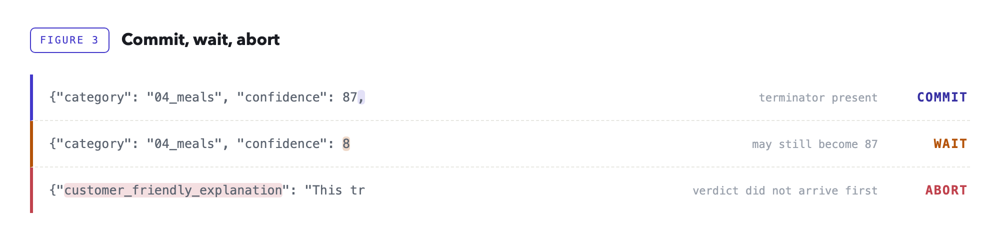
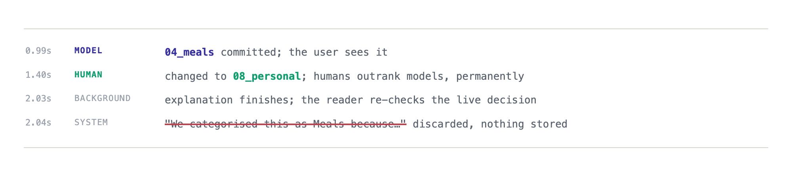

At ANNA, our transaction classifier returns a JSON object with a category, a confidence score, two explanations and a citation. The category and confidence, the only fields the application acts on, fit in roughly the first thirty output tokens. The remaining couple of hundred tokens are prose written for people who may read it later, or never. Until recently we still waited for the closing brace before doing anything.

When we reordered the schema so the decision fields come first, and committed them as soon as they were provably complete, median time-to-act on our production path fell from 2.03 to 0.99 seconds. The explanation still arrives; it just no longer blocks anything. This article describes how we did it, what "provably complete" means for a half-received JSON document, and what we had to handle once the request path and the response lifetime came apart.

## How the response got slow

The classifier started with one job: look at a bank transaction and return a category. Coffee in, `04_meals` out. The response was a few tokens and felt instant.

Then the requirements grew, each for a good reason. The app needed to explain a category to the customer, so we added a customer-facing explanation. Our accountants wanted a technical explanation and a pointer to the relevant guidance for reviewing odd cases, so we added an internal explanation and a citation. Finally we added a confidence score to route uncertain transactions to a review queue.

Each field had a real consumer, but not the same deadline. The category and confidence are needed right away; the explanations are read later, on another screen or during an investigation. Because each field was appended as it was requested, confidence ended up last, and the moment the application could act moved to the end of the response.


*Figure 1 — How product requests moved the commit point. The field order followed the order of requests, not the order of urgency. Image by the author.*

A typical response, lightly redacted:

```json
{
  "category": "09_general_purchase",
  "confidence": 75,
  "customer_friendly_explanation": "This purchase has been categorised as a general business purchase. If it was for stock, office equipment, or personal use, you can update the category.",
  "internal_explanation": "The description denotes a payment to a general online marketplace. No invoice or line-item detail is attached and the amount is small, so the safest default for an ambiguous generic merchant is a general business purchase.",
  "citation": "Internal bookkeeping guidance, general business purchase."
}
```

I'll call the first two fields the *verdict* and the rest the *essay*. The obvious fixes were unattractive. Splitting the work into two model calls would double per-call overhead and rate-limit usage, and the second call could explain a different verdict from the one already committed. Shortening the essay meant taking features away from accountants. What we changed instead was how we read the response we already had.

## What already exists

Streaming structured output is not new. [Instructor](https://python.useinstructor.com/concepts/partial/) yields partially filled Pydantic models as tokens arrive, the [Vercel AI SDK](https://ai-sdk.dev/v5/cookbook/node/stream-object) exposes a `partialObjectStream`, and libraries such as [partial-json](https://www.npmjs.com/package/partial-json) parse incomplete JSON directly. These tools are built mainly for rendering: show the user something as early as possible.

Rendering and acting are different problems. A partial object tells you a field has *appeared*, not that its value is *final*, and showing a half-finished value for a moment is fine while writing it to a database is not. The rest of this article is about that gap: deciding when a streamed field is safe to act on, and what has to happen after you act on it.

## Field order is part of the latency budget

When a provider enforces a JSON schema during decoding, the field order in the schema is also the order in which values are generated. The last verdict field therefore sets the earliest point at which the application can act. Our fix started with a one-line change in the schema: move `confidence` up next to `category`.

```json
{
  "type": "object",
  "additionalProperties": false,
  "properties": {
    "category":   { "type": "string", "enum": ["01_income_employment", "...", "08_personal"] },
    "confidence": { "type": "number", "minimum": 0, "maximum": 100 },
    "customer_friendly_explanation": { "type": "string" },
    "internal_explanation": { "type": "string" },
    "citation": { "type": "string" }
  }
}
```

How the order is expressed differs by provider: some have an explicit ordering property, others follow the order of `properties`. Strict modes usually also require every property to be listed in `required` and reject `additionalProperties`. Whatever the API, check that the order survives on the exact model and endpoint you run in production, because this is the assumption everything else rests on. Also make every field `required`: in our tests, when only the verdict was required and `confidence` came last, Gemini skipped the explanations entirely and wrote `confidence` straight after `category`.


*Figure 2 — Same fields and tokens; only the commit point moves. Image by the author.*

Nothing is generated faster. The tokens the application needs simply arrive earlier.

Moving a field ahead of the text that explains it can, in principle, change what the model outputs, since an autoregressive model conditions each token on everything before it. We checked this separately; see the measurements below.

## When is a streamed value final?

A stream arrives as a sequence of chunks, and their boundaries are arbitrary: a chunk can end inside a string, after the first digit of a number, or just before the comma that closes a value. So the parser always works on the accumulated buffer, never on an individual chunk.

The hard part is knowing when a value can no longer change. Suppose the buffer currently holds:

```json
{
  "category": "04_meals",
  "confidence": 8
```

A partial parser will happily report `confidence = 8`, but the next chunk might be `7,`, and the real value is 87. A number is final only once it is followed by a terminator (a comma, a closing brace or whitespace); a string is final only after its closing quote.

We wanted the early path to be conservative. Missing an early verdict is fine, since the system can wait for the full response or fall back to a deterministic categorizer. Acting on a misparsed verdict is not. Before committing, the parser therefore requires three things:

1. **The value is complete.** A closing quote for `category`, a terminator after `confidence`.
2. **The value is in the allowed set.** We check `category` against the same enum used in the schema, even though constrained decoding should already guarantee it. This also covers prefix ambiguity: if both `04_meals` and `04_meals_entertainment` exist, seeing `04_meals` proves nothing until the closing quote arrives.
3. **The order is intact.** If an essay field appears before the verdict is complete, the provider has broken the ordering contract. We don't try to recover; we abandon the early path and let the normal pipeline handle the request.



*Figure 3 — Commit, wait, abort. The middle buffer waits because the next chunk may turn 8 into 87. Image by the author.*

The core of the parser:

```python
DECISION_RE = re.compile(
    r'"category"\s*:\s*"(?P<category>[A-Za-z0-9_]+)"\s*,\s*'
    r'"confidence"\s*:\s*(?P<confidence>\d+(?:\.\d+)?)'
    r'\s*[,}\s]'   # check 1: terminator required
)

class DecisionParser:
    def __init__(self) -> None:
        self.buffer = ""

    def feed(self, chunk: str) -> Optional[Decision]:
        self.buffer += chunk
        match = DECISION_RE.search(self.buffer)
        if match:
            category = match.group("category")
            if category not in CATEGORY_ENUM:          # check 2: membership
                raise AbortEarlyCommit(category)
            confidence = float(match.group("confidence"))
            if not 0 <= confidence <= 100:
                raise AbortEarlyCommit(confidence)
            return Decision(category, confidence)
        # order check only after the match attempt: one chunk may hold
        # the end of the verdict and the start of the essay
        if any(m in self.buffer for m in ESSAY_MARKERS):  # check 3: order
            raise AbortEarlyCommit("essay before verdict")
        return None
```

The order of the checks inside `feed` matters. A single chunk can contain both the end of `confidence` and the start of the first explanation, so checking for essay fields first would reject a valid stream. The full listing and tests are in [github.com/nturusin/llm-streaming-early-commit](https://github.com/nturusin/llm-streaming-early-commit); it uses only the standard library.

## After the commit

In our app, a deterministic categorizer shows a provisional category immediately. At a median of about one second the model's verdict replaces it, while the response keeps streaming for roughly another second.

The open stream is handed to a bounded background worker, which drains the remaining chunks, assembles and validates the complete JSON, checks that the final verdict matches the one already committed, and stores the explanations. The guarantee comes from the structural checks above; the worker is a second line of defence that would surface a mismatch if a provider update ever broke the ordering. If the stream fails during the drain, the verdict stands and the explanation slot stays empty.

There is one race that has nothing to do with JSON. While the essay is still streaming, a person can change the category.



*Figure 4 — The application state can change while the stream is still open. Image by the author.*

So before storing the essay, the worker checks whether the model still owns the decision. If a person has overridden it, the explanation is discarded: it would justify a category the transaction no longer has.

The parser turned out to be the small part. Most of the work was in the operational details around it:

| Risk | Policy |
|---|---|
| Slow verdict | A hard 2-second deadline for the verdict; on expiry the deterministic pipeline answers. In production this happens for about 7% of live requests. |
| Caller disconnects | Before the commit, cancel the upstream generation. After it, the drain is expected to outlive the request. |
| Retries | Never retry a live stream: a retry is a second generation, a second bill and a race between two commits. |
| Proxy buffering | Any layer in between can silently batch the stream. Everything still works, just late, so test incrementality end to end. |
| Connection pressure | Bound the background drains (we run 64) and size connection pools for the full response lifetime, not the verdict time. |
| Deploys | Decide explicitly what happens to in-flight drains. The verdicts are safe; only explanations are lost. |
| Usage accounting | Token usage often arrives in the final chunk, so a stream closed early makes cost dashboards undercount. |
| Cost | Closing the stream right after the verdict saves output tokens but loses the essay. That is a separate trade-off with different product semantics. |

## What we measured

These numbers come from production: 288,298 live requests between August and early October 2026. They are timed inside our service, so they include the network and our LLM proxy, not just the model.

| | Median | p90 |
|---|---|---|
| Time to early verdict | **0.99s** | 1.29s |
| Time to complete response | 2.03s | 2.50s |

The early verdict always matched the completed response: zero mismatches. That doesn't prove the rate is zero, but it puts it below about 0.001%. About 7% of requests missed the 2-second deadline and were answered by the deterministic pipeline instead.

Why roughly half? Each request carries about 28,000 input tokens and produces about 220 output tokens. Reading the input is a fixed cost; early commit removes most of the time spent writing the output. Your ratio will depend on how much of the response comes after the decision fields. If the full response already fits your latency budget, this isn't worth the extra complexity.

**Does the new order change the answers?** We replayed 400 production requests at temperature 0 with three schemas: the current verdict-first order, the old order with `confidence` last, and a placebo that keeps the verdict first but shuffles the explanation fields. We also ran the current schema a second time to measure the model's own noise.

| Compared with the current schema | Category changed |
|---|---|
| Same schema, run again | 1.8% |
| Old order (`confidence` last) | 7.8% |
| Placebo (explanations shuffled) | 7.3% |

Confidence didn't shift in either direction (average change −0.2 points). But the category changed as often with the placebo as with the real reorder, even though `category` comes first in every version. The model reacts to *any* schema change, because the schema is part of its input. So treat a reorder like a prompt change and evaluate it before shipping. This measures stability, not accuracy: few of these transactions have a human-checked label.

## When not to do this

- **The decision can't be made a short, closed-set value.** Free-form answers have no reliable point at which they are final, and a verdict that needs later fields to be interpreted is not a verdict.
- **The provider doesn't give you constrained decoding with stable field order on streamed output.** Then there is nothing safe to commit early, and the right behaviour is to wait.
- **There is no deterministic fallback, or the full response is already fast enough.** Early commit adds concurrency, parsing and lifecycle management, and only pays off when the latency matters.

## Trying it on your system

Put a closed-set decision first and the long explanation last, stream the response, and record when the decision becomes structurally final compared with when the response completes. The repository includes a probe that does this against a real model and reports whether the field order held, whether the early verdict matched the final object, and how much time came off the critical path.

Before relying on it, check schema enforcement, field ordering and chunk behaviour in your provider's documentation and on the exact model you plan to ship:

- **OpenAI** — [Structured Outputs](https://developers.openai.com/api/docs/guides/structured-outputs) · [Streaming Responses](https://developers.openai.com/api/docs/guides/streaming-responses)
- **Anthropic** — [Structured Outputs](https://platform.claude.com/docs/en/build-with-claude/structured-outputs) · [Streaming Messages](https://platform.claude.com/docs/en/build-with-claude/streaming)
- **Google Gemini** — [Structured Outputs](https://ai.google.dev/gemini-api/docs/structured-output)
- **Amazon Bedrock** — [Structured Outputs](https://docs.aws.amazon.com/bedrock/latest/userguide/structured-output.html)
- **vLLM** — [Structured Outputs](https://docs.vllm.ai/en/latest/features/structured_outputs/)

None of the individual pieces is new: constrained decoding, incremental parsing, background work and fallbacks are all standard. What changes is *when* the system is allowed to act. A structured response doesn't have to be complete for part of it to be final.
